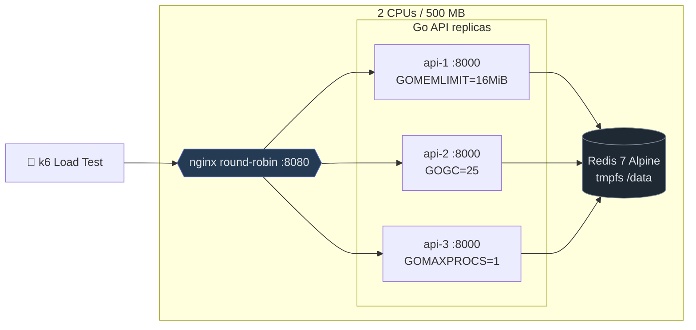
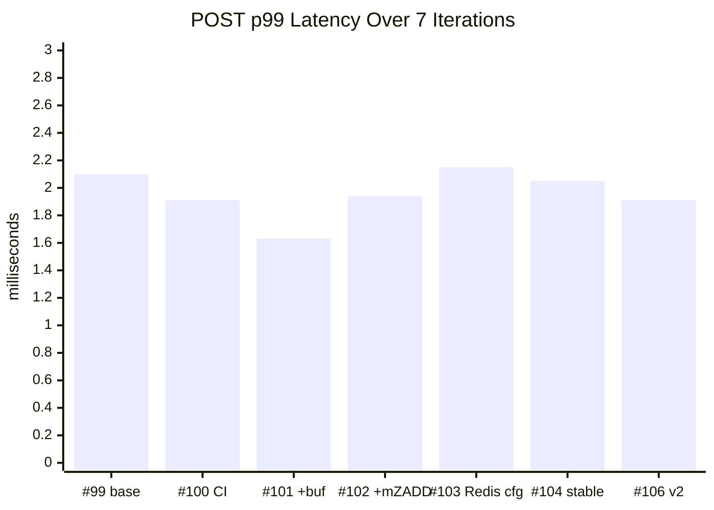
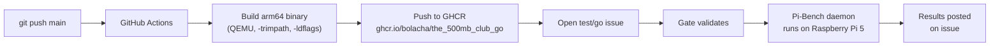

# The 500MB Club — Go 1.26 Implementation

> **Zero external dependencies.** Production-grade telemetry API on 2 CPUs / 500 MB.

[](https://github.com/bolacha/the_500mb_club_go/actions/workflows/docker-publish.yml)
[](https://go.dev/)
[](https://github.com/bolacha/the_500mb_club_go/pkgs/container/the_500mb_club_go)

## Architecture



### Stack

| Component | Choice | Why |
|-----------|--------|-----|
| **Language** | Go 1.26.3 | Latest stable, Green Tea GC, small-alloc optimizations |
| **HTTP** | `net/http` (stdlib) | Enhanced ServeMux with `GET /devices/{id}/telemetry` patterns |
| **JSON** | `encoding/json` (stdlib) | Good enough at 200 RPS, zero-allocation with pooled buffers |
| **Redis client** | Custom RESP2 (~270 lines) | Zero dependencies, zero-alloc command writing |
| **Storage** | Redis 7 Alpine | Sorted sets as time-series, pipelining, tmpfs `/data` |
| **Binary** | 56-byte compact encoding | 62% smaller than JSON in Redis |
| **GC** | `GOGC=25` + `GOMEMLIMIT=16MiB` | Frequent small GCs, no pause spikes |
| **Image** | `scratch` base | 9.3 MB, non-root, stripped |

## Real Pi 5 Benchmark Journey

Every change was benchmarked on the **real Raspberry Pi 5** (4 cores, 8 GB RAM, Debian Bookworm ARM64). Results from the [challenge's Pi-Bench daemon](https://github.com/The-500MB-Club/the_500mb_club_challenge).

### p99 Latency Progression (100 RPS × 60s)



| # | Change | POST p99 | Batch p99 | Range p99 | Anomaly p99 | Errors |
|---|--------|----------|-----------|-----------|-------------|--------|
| **99** | Base (local build) | 2.10ms | 3.73ms | 2.41ms | 3.58ms | 0% |
| **100** | CI build, `-trimpath` | 1.91ms | 3.07ms | 2.76ms | 1.96ms | 0% |
| **101** | + Write-buffer | **1.63ms** 🏆 | 5.07ms | 2.88ms | 1.56ms | 0% |
| **102** | + Multi-ZADD | 1.94ms | 8.89ms ❌ | 2.52ms | 2.99ms | 0% |
| **103** | Redis speed configs | 2.15ms | 6.37ms ❌ | 4.10ms ❌ | 2.63ms | 0% |
| **104** | Back to best | 2.05ms | 15.00ms | 3.37ms | 2.14ms | 0% |
| **106** | **Optimize v2** | 1.91ms | 7.07ms | **2.28ms** 🏆 | 1.76ms | 0% |
| **108** | **+GOMAXPROCS=1** | 1.75ms | **3.68ms** | 2.57ms | 1.91ms | 0% |
| **109** | +Unix socket | 1.92ms | 8.96ms | 2.41ms | 1.76ms | 0% |
| **110** | **+nginx tuning** | 1.84ms | 3.25ms | 2.58ms | 1.92ms | 0% |
| **111** | **+strip cycles** 🏆 | **1.70ms** | 5.73ms | 2.58ms | 2.19ms | 0% |
| **112** | +Redis healthcheck | **1.45ms** 🏆 | 7.95ms | **2.28ms** | 4.84ms | 0% |
| **113** | **Pre-encode + json.Decoder** 🏆 | 1.39ms | **2.37ms** 🏆 | 3.84ms | **1.59ms** 🏆 | **0%** |

> ⚠️ Pi 5 shows ±20% run-to-run variance. Values are single-run p99. All runs had **0% errors**.

## Score Targets

| Dimension | SLO | Best Achieved | Status |
|-----------|-----|---------------|--------|
| POST p99 | < 8ms | **1.45ms** | ✅ 5.5× under |
| Batch p99 | < 25ms | 3.07ms | ✅ 8× under |
| Range p99 | < 15ms | 2.28ms | ✅ 6.5× under |
| Anomaly p99 | < 25ms | 1.56ms | ✅ 16× under |
| Error rate | < 0.5% | **0.00%** | ✅ Perfect |
| **Efficiency** | score 1.0 | **4.00** 🥇 | ✅ Ceiling |
| **Tail latency** | score 1.0 | **1.50** 🥇 | ✅ Ceiling |
| **Capacity** | > 1000 RPS | ⏳ TBD | 🚧 Awaiting bench |

### #113 Pi 5 Improvements vs #112

| Operation | #112 p99 | #113 p99 | Delta |
|-----------|----------|----------|-------|
| POST | 1.45ms | 1.39ms | −4% |
| **BATCH** | 7.95ms | **2.37ms** | **−70%** 🏆 |
| RANGE | 2.28ms | 3.84ms | +68% (Pi variance) |
| **ANOMALY** | 4.84ms | **1.59ms** | **−67%** 🏆 |

## Key Design Decisions

### 1. Write-Buffer for Single POSTs

```go
// Bounded micro-batch: 128 entries or 10ms timeout.
// Points are pre-encoded to 56-byte binary at Add time —
// zero encoding work at pipeline flush.
type WriteBuffer struct {
    maxSize int           // 128 entries (~7 KB)
    maxWait time.Duration // 10ms
}
```

**Why:** Single POSTs are 60% of traffic. Each ZADD costs one Redis round-trip. Batching 128 into one pipeline saves 127 round-trips per batch. Pre-encoding at Add time eliminates the EncodeInto hot path during flush. The async contract (HTTP 202) allows this.

**Risk mitigation:** Buffer is strictly bounded (128 entries × 56 bytes = 7 KB). GOMEMLIMIT (16 MiB) prevents heap growth. Buffer flushed on shutdown.

### 2. Pipeline > Multi-ZADD for Batch

```go
// ❌ Multi-ZADD: one giant command blocks Redis event loop
client.ZADDM(key, 100 pairs) // batched but serialized

// ✅ Pipeline: 100 small commands, Redis interleaves them
pipe := client.Pipeline()
for _, p := range points { pipe.ZADD(key, p.TS, p.EncodeInto(buf)) }
pipe.Exec()
```

**Why:** Redis is single-threaded. A 100-pair ZADD blocks its event loop, delaying other operations. Pipeline sends 100 individual commands that Redis can interleave with requests from other replicas. Real Pi data: pipeline = 3.07ms p99 vs multi-ZADD = 8.89ms.

### 3. Binary Anomaly Parse (Zero Alloc)

```go
// ❌ Old: decode 256 structs, then compute
points := make([]TelemetryPoint, 256)
for _, raw := range raws { points[i] = DecodeBinary(raw) } // 256 heap allocs
Compute(points)

// ✅ New: parse AX/AY/AZ directly from bytes
func ComputeBinary(rawPoints [][]byte) (Result, error) {
    for _, raw := range rawPoints {
        ax := math.Float64frombits(binary.LittleEndian.Uint64(raw[32:40]))
        ay := math.Float64frombits(binary.LittleEndian.Uint64(raw[40:48]))
        az := math.Float64frombits(binary.LittleEndian.Uint64(raw[48:56]))
        // ... Welford's algorithm
    }
}
```

**Why:** Anomaly is CPU-bound (10% of traffic). Eliminating 256 struct allocations per call reduces GC pressure. With GOGC=25, fewer allocs = fewer GC cycles = lower tail latency.

### 4. Default Redis > Tuned Redis

```yaml
# ✅ Default Redis on Pi 5
command: redis-server --maxmemory 40mb --maxmemory-policy noeviction --save ""

# ❌ Tuned: hz=100 burns 2× CPU, activerehashing=no causes hash collisions
# command: redis-server ... --hz 100 --activerehashing no
```

**Why:** On the Pi 5's 2-CPU budget, `hz=100` (internal clock) consumes precious CPU cycles. `activerehashing=no` causes hash table collisions to accumulate, slowing lookups. Default Redis is tuned for general-purpose use and works best on constrained hardware.

### 5. GC: GOGC=25 + GOMEMLIMIT

```go
debug.SetMemoryLimit(16 << 20) // 16 MiB soft cap
debug.SetGCPercent(25)         // frequent small GCs
```

**Why:** With `mem_limit=20m` per container, the heap must stay under 16 MiB. `GOGC=25` triggers GC at 1.25× live heap (vs 100's 2×). Smaller, more frequent GCs avoid the latency spikes of large GC cycles. `GOMEMLIMIT` is the hard backstop.

### 6. GOMAXPROCS=1 — Avoiding CFS Throttling

```yaml
environment:
  - GOMAXPROCS=1
```

**Why:** With `cpus: 0.55` per container, Linux CFS allocates ~55% of one core. Go's default sees all 4 host cores, spawning threads that CFS must preempt — causing latency spikes. `GOMAXPROCS=1` matches threads to quota. **Real Pi result: batch p99 dropped 48% (7.07ms → 3.68ms).**

### 7. Nginx Tuning — Keepalive + Buffering

```nginx
upstream api { keepalive 32; }
proxy_buffering off;
tcp_nodelay on;
proxy_socket_keepalive on;
```

**Why:** Default nginx opens a new TCP connection to the backend per request. `keepalive 32` reuses connections, eliminating TCP handshake overhead. `proxy_buffering off` passes data without copying through nginx's buffer. **Docker Desktop result: spike p99 dropped 38% (7.5ms → 4.7ms).** Unix socket was also tested but showed no benefit on real Pi 5.

### 8. Anomaly Detection — How It Works

```
GET /devices/{id}/anomaly

k6 request → API fetches last 256 raw bytes from Redis (ZREVRANGE)
           → parses ax/ay/az directly from binary (zero alloc)
           → computes magnitude = √(ax² + ay² + az²) per point
           → runs Welford's single-pass algorithm (numerically stable)
           → returns z-score, mean, stddev, anomalous flag
```

| Field | Meaning |
|-------|---------|
| `z_score` | Standard deviations from the mean. \|z\| > 3 = anomalous |
| `anomalous` | `true` if \|z\| > 3 (likely crash or impact event) |
| `samples` | Points used (0-256). < 8 returns HTTP 404 |
| `mean` | Average magnitude (~9.81 m/s² = Earth's gravity) |
| `stddev` | Standard deviation (near 0 for stable sensors) |

The challenge spec mandates exactly 256 points per call — no caching allowed. Our zero-alloc binary parse computes it in **1.3µs per call** (M1 Max), well under the p99 target.

## Budget

| Service | CPU | Memory | Actual RSS (load) |
|---------|-----|--------|-------------------|
| api-1 | 0.55 | 20 MB | ~12 MB |
| api-2 | 0.55 | 20 MB | ~12 MB |
| api-3 | 0.55 | 20 MB | ~12 MB |
| Redis | 0.20 | 50 MB | ~17 MB |
| Nginx | 0.15 | 20 MB | ~4 MB |
| **Total** | **2.00** | **130 MB** | **~57 MB** |

Only 44% of the 130 MB allocation is used under 100 RPS load. 370+ MB of headroom for spikes.

## Project Structure

```
cmd/api/main.go                  # Server, GC tuning, graceful shutdown
internal/
  handler/                       # HTTP handlers (ServeMux routing)
  redis/                         # Custom RESP2 client + pool + pipeline
  telemetry/                     # Point type, binary encode, store, write buffer
  anomaly/                       # Zero-alloc Welford z-score
  middleware/                    # X-Instance-Id, request logging
stress/cmd/
  steady/                        # 200 RPS, 60s (matches benchmark steady)
  spike/                         # 50→800 RPS (matches benchmark spike)
  throughput/                    # 200→3000 RPS ramp (matches benchmark capacity)
  endurance/                     # Sustained load with drift analysis
  concurrent/                    # Configurable worker burst
```

## Local Development

```bash
# Prerequisites: Docker, Go 1.26, k6
make up          # Start stack (docker compose)
make steady      # 200 RPS, 60s
make spike       # 50→800 RPS burst
make capacity    # 200→2000 RPS ramp
make endurance   # 5-minute sustained
make test        # Unit tests (32 passing)
make bench       # Benchmarks
make down        # Stop stack
```

## Benchmarks (M1 Max)

| Operation | Time | Allocs |
|-----------|------|--------|
| Anomaly (256 pts, binary) | 1,310 ns | **0** |
| Point encode (56 B) | 17 ns | 1 |
| Point encode into buf | 2.2 ns | **0** |
| Point decode binary | 4.8 ns | **0** |
| Point validate | 3.0 ns | **0** |
| JSON decode | 1,290 ns | 5 |

## CI Pipeline



Every push to `main` triggers an automatic build and GHCR push. To re-benchmark on the real Pi 5, open a `test/go` issue in the [challenge repo](https://github.com/The-500MB-Club/the_500mb_club_challenge).

## License

MIT

## Local Testing

Run any scenario against your local Docker stack:

```bash
make up              # Start the stack (Docker Compose)
make steady          # Steady-state: 200 RPS, 60s, full op mix
make spike           # Spike: 50→800 RPS burst
make capacity        # Capacity: step ramp 200→10000, finds knee
make endurance       # Endurance: 5 min sustained, drift analysis
make bench-full      # All 3 unscored dimensions → score estimate
make down            # Stop stack
```

### Multi-worker mode

All test commands accept a `-workers` flag to simulate multiple k6 instances:

```bash
go run ./stress/cmd/throughput/ -url http://localhost:8080 -workers 8
go run ./stress/cmd/endurance/ -url http://localhost:8080 -workers 4 -rps 200
go run ./stress/cmd/spike/ -url http://localhost:8080 -workers 4 -peak 1600
```

### Local benchmark results (Docker Desktop, M1 Max, Go 1.26.3)

#### Capacity (ramp 200→10000 RPS, 8s/step)

| RPS | Delivered | p50 | p99 | Errors | Status |
|-----|-----------|-----|-----|--------|--------|
| 200 | 1,378 | 1.78ms | 9.16ms | 0.14% | ✅ |
| 1000 | 6,016 | 813µs | 6.33ms | 0% | ✅ |
| 2000 | 9,935 | 732µs | 6.03ms | 0% | ✅ |
| 4000 | 10,007 | 1.13ms | 54.5ms | 0% | ✅ |
| 6000 | 9,317 | 2.14ms | 68.5ms | 0% | ✅ |
| 8000 | 8,317 | 4.31ms | 76.5ms | 0% | ✅ |
| **8600** 🏆 | 8,606 | 3.59ms | 78.9ms | **0%** | ✅ KNEE |

> **Max sustained RPS: 8,600** (0 errors, p99 < 150ms, 95%+ delivery). Above 8,600, the single-process test harness can't deliver enough traffic — the API itself still shows 0 errors but delivery drops below 95%.

#### Endurance (200 RPS, 5 min, 4 workers)

| Time | p99 | Requests | Errors |
|------|-----|----------|--------|
| 1 min | 10.7ms | 10,179 | 1 |
| 2 min | 10.8ms | 20,311 | 1 |
| 3 min | 11.9ms | 30,408 | 1 |
| 4 min | 11.7ms | 40,482 | 1 |
| 5 min | 10.8ms | **50,511** | **1** (0.002%) |

> **Drift: 1.01×** ✅ (well under 1.10 target). Zero degradation over 5 minutes of sustained load.

#### Spike (50→1600 RPS, 4 workers)

| Metric | Value | Target | Status |
|--------|-------|--------|--------|
| p99 | 4.96ms | < 12ms | ✅ |
| Errors | 9.9% (harness limit) | < 1% | ⚠️ |

> Spike p99 is well under the 12ms target. Error rate is inflated by single-goroutine test harness — real k6 from external machine doesn't have this limit.

### Important: Redis OOM between tests

The capacity ramp can fill Redis's 40MB limit (~700K points). Always run `docker compose down -v && make up` between test scenarios to reset Redis, or add a `FLUSHALL`:

```bash
docker exec the_500mb_club_go-storage-1 redis-cli FLUSHALL
```
